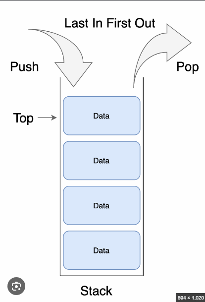
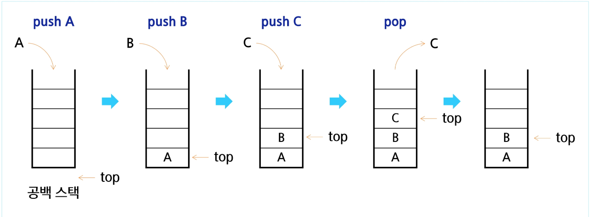
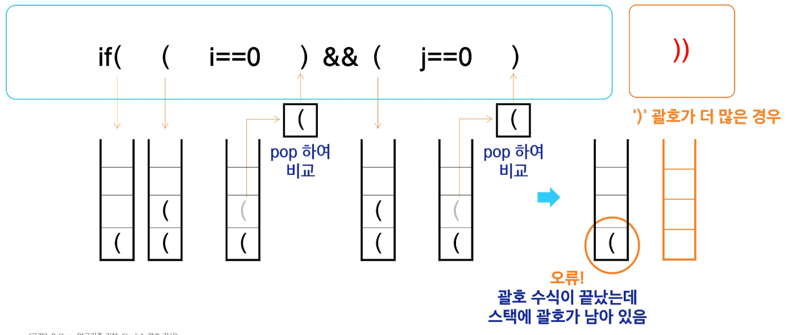
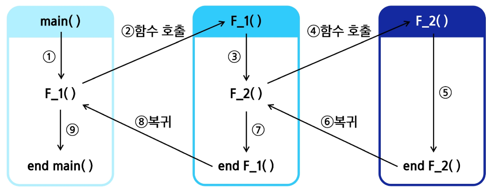
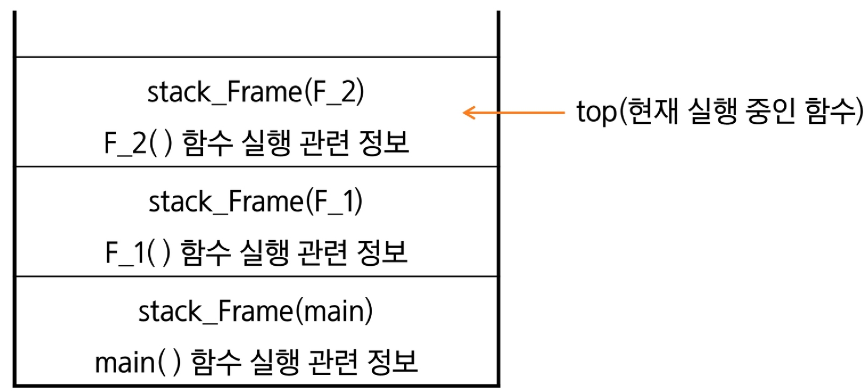
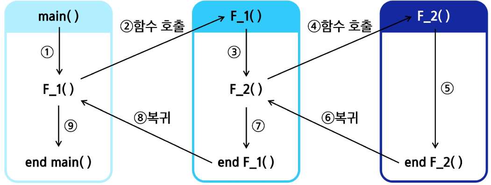
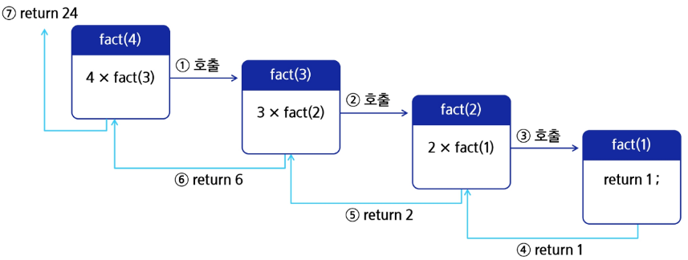
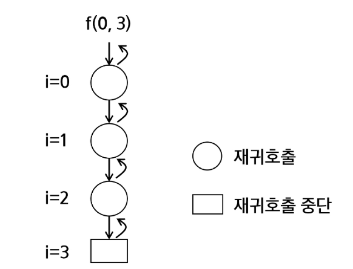
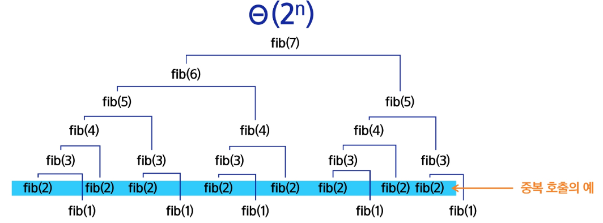
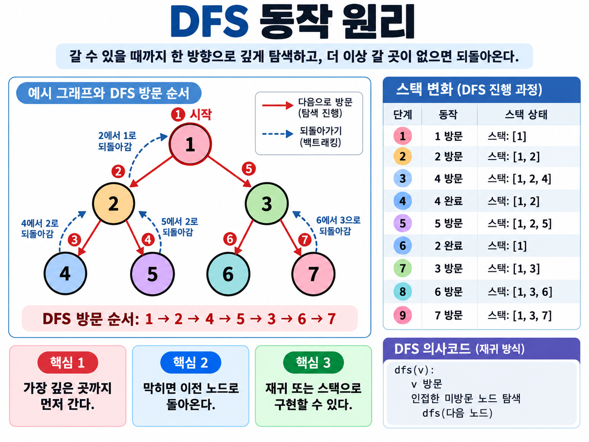

### 1. 스택

> 대표적인 선형 자료 구조 중 하나로 물건을 쌓아 올리듯 자료를 쌓아 올린 형태의 자료구조
>

#### Stack은 **후입선출**이다. **LIFO**, Last-In-First-Out



#### 스택을 프로그램에서 구현하기 위해서 필요한 자료구조와 연산

1. `배열`을 이용해 구현할 수 있다.
    - 파이썬에서는 `리스트` 를 이용해서 구현할 수 있다.
2. 저장소 자체를 스택이라고 부르기도 한다.
    - 용도에 따라 메모리 일부를 스택으로 부른다.
3. 스택에서 마지막 삽입된 원소의 위치이다.
    - 스택 포인터, top으로 부르며, 데이터를 넣거나 뺄 때 기준이 되는 위치다.

#### 스택의 연산

1. 삽입 (Push)
    - 저장소에서 자료를 저장하는 연산으로 push라고 부른다.
2. 삭제 (Pop)
    - 저장소에서 삽입한 자료의 역순으로 꺼내는 연산으로 보통 pop이라고 부른다.
3. 스택이 공백인지 아닌지 확인하는 연산 (isEmpty)
    - 스택이 비어 있으면 True, 아니면 False이다.
4. 스택의 top에 있는 item을 반환하는 연산
    - 삭제는 하지 않는다.



#### Push 연산

- `append` 를 이용해 리스트 마지막에 데이터 삽입

```python
# append 를 이용해 리스트 마지막에 데이터 삽입
stack = []

def my_push(item):
	stack.append(item)
```

- `인덱스 연산`을 활용한 구현

```python
def my_push(item, size):
	global top
	top += 1
	if top == size:
		print("Overflow")
	else:
		stack[top] = item
```

- 크기가 정해진 리스트와 인덱스 연산을 활용한 구현

```python
size = 10
stack = [0] * size
top = -1

my_push(10, size)
top += 1
stack[top] = 20
```

#### Pop 연산

- 남은 데이터 중 가장 늦게 저장된 데이터를 삭제하는 연산

```python
def my_pop() :
	if len(s) == 0:
		print("Underflow")
		return
	else:
		return s.pop       # 리스트 s의 마지막 원소 삭
```

- 크기가 정해진 리스트와 인덱스 활용한 구현

```python
def my_pop():
	global top
	if top == 1:
		print("Underflow")
		return 0
	else:
		top -= 1
		return stack[top+1]
	
print(my_pop())
```

#### 스택 구현 시 고려 사항

1. 1차원 배열을 사용하여 구현할 경우
    - 장점: 구현이 용이하다.
    - 단점: 스택의 크기를 변경하기가 어렵다.
2. 해결 방법: 저장소를 동적으로 할당하여 스택을 구현하는 방법 (동적 연결 리스트를 이용해 구현하는 방법)
    - 장점: 메모리를 효율적으로 사용한다.
    - 단점: 구현이 복잡하다.

### 2. 스택의 응용

#### 괄호 검사

**조건**

1. 왼쪽 괄호 개수와 오른쪽 괄호의 개수가 같아야 한다.
2. 같은 괄호에서 왼쪽 괄호는 오른쪽 괄호보다 먼저 나와야 한다.
3. 괄호 사이에는 포함 관계만 존재한다.
- 스택을 이용한 괄호 검사



#### 알고리즘 개요

1. 문자열에 있는 괄호를 차례대로 검사하면서 왼쪽 괄호를 만나면 스택에 삽입하고, 오른쪽 괄호를 만나면 스택에서 top 괄호를 삭제한 후 오른쪽 괄호와 짝이 맞는지 검사한다.
2. 스택이 비어있으면 **조건 1** 또는 **조건 2** 에 위배되고, 괄호의 짝이 맞지 않으면 **조건 3**에 위배 된다.
3. 마지막 괄호까지 조사한 후에도 스택에 괄호가 남아 있으면 **조건 1**에 위배된다.

---

### 3. Function call

> 프로그램에서의 함수 호출과 복귀에 따른 수행 순서를 관리한다.
>



**가장 마지막에 호출된 함수가 가장 먼저 실행을 완료하고 복귀하는 후입 선출 구조**이므로, 후입선출 구조의 스택을 이용해 수행 순서를 관리한다.

#### 시스템 스택

- 함수 수행에 필요한 지역 변수, 매개변수 및 수행 후 복귀할 주소 등의 정보를 저장한다.
- 함수 호출이 발생하면 스택 프레임에 저장해 시스템 스택에 삽입한다.





---
### 4. 재귀호출

> 함수가 자신과 같은 작업을 반복해야 할 때 자기 자신을 다시 호출하는 것 이다.
>

#### 팩토리얼 (factorial)

- 1부터 n까지 모든 자연수를 곱해 구하는 연산이다.




#### 피보나치 수열

- 0과 1로 시작하고, 이전 두 수의 합을 다음 항으로 하는 수열이다.

```python
# 수열의 i번 항을 반환하는 함수를 재귀 함수로 구현 가능하다.
def fibo(n):
	if n < 2:
		return n
	else:
		return fibo(n-1) + fibo(n-2)
```

#### 재귀함수의 기본형

- 현재 호출 단계와 목표 단계를 인자로 사용한다.




```python
def recursive(i, N):
	if i == N:        # 중단 조건
		return
	else:             # 재귀 호출
		frecursive(i + 1, N)
```


---

### 5. Memoization

#### 피보나치 재귀호출의 문제점

- 피보나치 수를 구하는 함수를 재귀 함수로 구현한 알고리즘은 `엄청난 중복 호출이 존재한다` 라는 문제가 발생한다.




#### 메모이제이션 (Memoization)

> 컴퓨터 프로그램을 실행할 때 이전에 계산한 값을 메모리에 저장해서 매번 다시 계산하지 않도록 하여 전체적인 실행 속도를 빠르게 하는 기술이다.
>
- `Memoization` 을 적용한 피보나치

```python
def fibo(n):
	if n >= 2 and memo[n] == 0:
		memo[n] = fibo(n-1) + fibo(n-2)
	return memo[n]

memo = [0] * (n+1)
memo[0] = 0
memo[1] = 1
```

---

### 6. DFS

> 깊이 우선 탐색 `DFS` , 한 방향으로 가능한 한 깊게 탐색한 후, 더 이상 갈 곳이 없으면 되돌아와 다른 방향을 탐색
>

#### DFS의 동작원리

1. 시작 정점의 한 방향으로 갈 수 있는 경로가 있는 곳까지 깊이 탐색해 나간다.
2. 더 이상 갈 곳이 없게되면, 가장 마지막에 만났던 갈림길 간선이 있는 정점으로 되돌아와서 다른 방향의 정점으로 탐색을 계속 반복하여 결국 모든 정점을 방문하는 탐색 방법이다.
3. **마지막에 만났던 갈림길의 정점으로 되돌아가서 다시 깊이 우선 탐색 반복해야 하므로 후입선출(LIFO) 구조의 스택**을 사용한다.

```
DFS 알고리즘
1. 시작 정점 v를 결정해 방문한다.

2. 정점 v에서 인접한 정점 중
	a. 방문하지 않은 정점 w가 있으면 정점 v를 스택에 push, 정점 w를 방문하고, w를 v로 해 다시 2를 반복한다.
	b. 방문하지 않은 정점이 없으면 탐색 방향을 바꾸기 위해 스택을 pop, 가장 마지막 방문 정점을 v로 해 다시 2를 반복한다.
	
3. 스택이 공백이 될 때까지 2를 반복한다.
```


```python
def dfs(v):
    visited = [False] * (N + 1)   # 방문 여부
    stack = []                    # 스택 초기화

    visited[v] = True             # 시작 정점 방문
    print(v, end=' ')

    while True:
        # 현재 정점 v와 인접한 정점 중
        # 아직 방문하지 않은 정점 w 찾기
        for w in graph[v]:

            if not visited[w]:
                stack.append(v)   # 현재 위치 저장

                v = w             # 다음 정점으로 이동
                visited[v] = True
                print(v, end=' ')

                break

        # 방문할 정점이 없는 경우
        else:
            if stack:
                v = stack.pop()   # 이전 정점으로 되돌아감

            else:
                break             # 스택도 비었으면 DFS 종료
```


