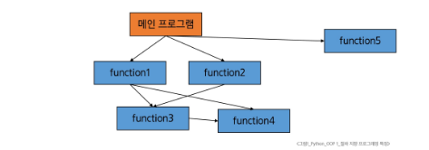
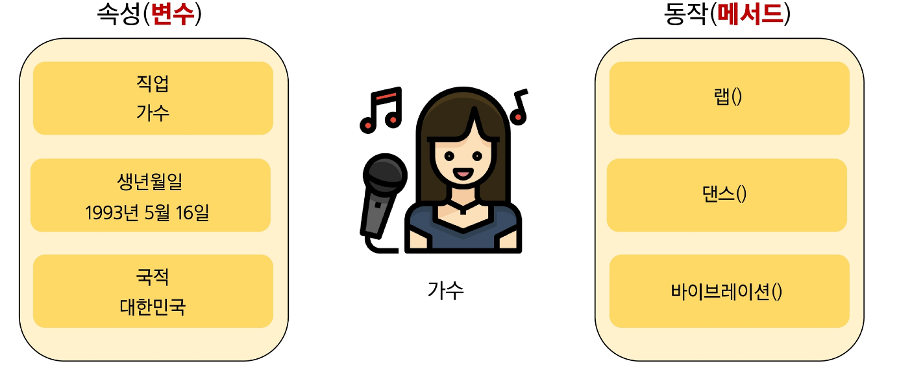
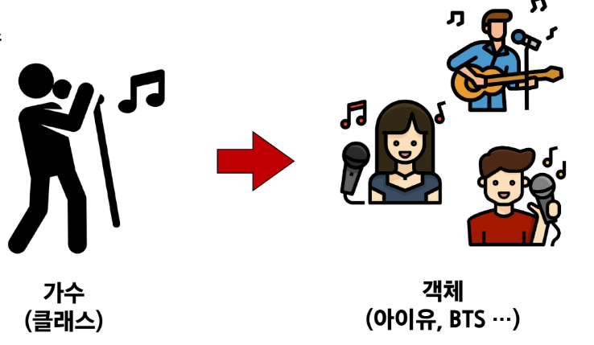
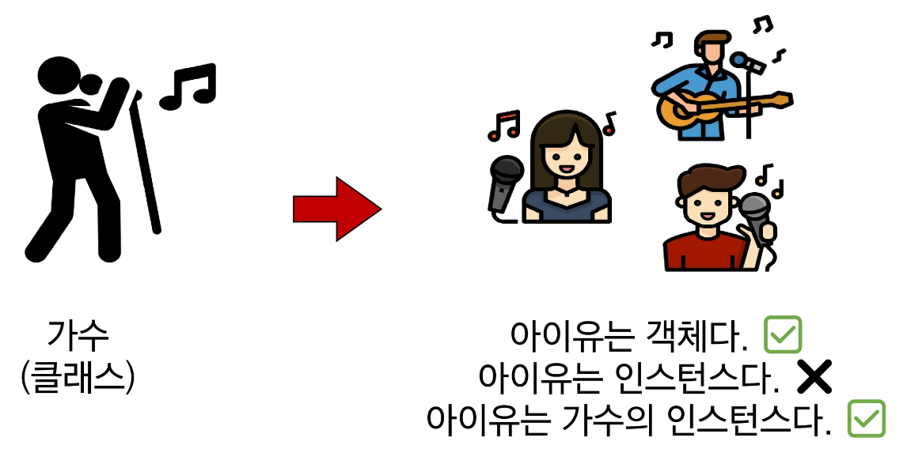
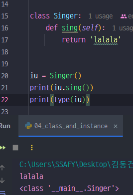

### 1. 절차 지향 프로그래밍

> 함수와 로직 중심으로 작성하고, **데이터를 순차적으로 처리**한다.
>

#### 절차 지향 프로그래밍 특징

1. 입력을 받고, 처리하고, 결과를 내는 과정이 위에서 아래로 순차적으로 흐르는 형태이다.
2. 순차적인 명령어 실행, 데이터와 함수의 분리, 함수 호출의 흐름이 중요하다.

#### 절차 지향 프로그래밍의 한계

1. 프로그램 규모가 커질수록 데이터와 함수의 관리가 어렵다.
2. 코드 수정 시 영향 범위 파악이 어렵다.



---

### 2. 객체 지향 프로그래밍

>
>
>
> **프로그래밍에서 필요한 데이터를 추상화시켜 상태와 행위를 가진 객체로 만들고,**
>
> **객체들 간의 상호작용을 통해 로직을 구성하는 프로그래밍 방법이다.**
>

#### 객체 지향 사고 예시

```python
# Person (객체)안에 name, age와 관련된 기능(메서드)를 포함한다.
class Person:
	def __init__(self, name, age):
		self.name = name
		self.age = age
	
	def introduce(self):
		print(f"안녕하세요, {self.name}입니다. 나이는 {self.age}살 입니다.")
		
alice = Person("Alice", 25)
alice = introduce() # 객체가 자신의 정보를 출력한다.
```

#### 객체 지향 프로그래밍의 특징

1. 프로그램을 데이터(변수)와 그 데이터를 처리하는 함수(메서드)를 하나의 단위(객체)로 묶어서 조직적으로 관리한다.
2. 데이터와 메서드의 결합이다.


> 💡 **절차 지향과 객체 지향은 대조되는 개념은 아니다!!!!**


---

### 3. 객체와 클래스

#### 객체 (Object)

- 실제 존재하는 사물을 추상화한 것, `속성 (변수)` , `동작 (메서드)` 를 가진다.





#### 클래스 (Class)

- 데이터(속성)와 기능(메서드)을 하나의 `묶음` 으로 정의하는 설계도이다.
- 클래스 이름은 파스칼 케이스 방식으로 작성한다.
- `__init__` 메서드는 `생성자 메서드` 로 불리며, 새로운 객체를 만들 때 필요한 초기값을 설정한다.
    - `생성자 __init__ - 인스턴스가 만들어질 때 자동으로 실행된다.`

---

### 4. 인스턴스

> 클래스를 통해 생성된 객체이다.
>

#### 인스턴스 예시

```python
# 인스턴스 1
person1 = Person("Alice", 25)
person1.introduce() # 안녕하세요. 저는 Alicae, 나이는 25살입니다.
# 인스턴스 2
person2 = Person("Bella", 30)
person2.introduce() # 안녕하세요. 저는 Bella, 나이는 30살입니다.
```



#### 클래스와 인스턴스

- 클래스를 정의한다는 것은 **공통된 특성과 기능을 가진 틀**을 만드는 것이다.
- 실제 활동하는 개개별 객체들은 이 틀에서 생성된 인스턴스이다.
- 공통된 특성과 기능을 가진 틀을 만드는 것은 새로운 타입을 만드는 행위이다.
- **인스턴스(객체)**는 클래스를 이용해 실제로 생성된 객체이며, `type(인스턴스)`를 출력하면 해당 클래스가 나온다.




> 💡 우리가 사용해왔던 데이터 타입은 사실 모두 클래스였다.


---

### 5. 클래스의 구성요소

#### 생성자 메서드

- 인스턴스 생성 시 자동 호출되는 특별한 메서드
- `__init__` 이라는 이름의 메서드로 정의된다.
- 인스턴스 변수의 초기화를 담당한다.

#### 인스턴스 변수

- 각 인스턴스별 고유한 속성
- `self.변수명` 형태로 정의한다.
- 인스턴스마다 독립적인 값을 유지한다.

#### 클래스 변수

- 모든 인스턴스가 공유하는 속성이다.
- 클래스 내부에서 직접 정의한다.

```python
# =============================================================
# 클래스의 구조 - 클래스 변수 vs 인스턴스 변수
# - 클래스 변수  : 모든 인스턴스가 '공유'하는 값 (설계도에 적힌 값)
# - 인스턴스 변수 : 인스턴스마다 '따로' 갖는 값 (붕어빵마다 다른 속)
# =============================================================

class Circle:
    # 클래스 변수: 클래스 안, 메서드 밖에 정의
    # => 모든 Circle 인스턴스가 공유 (원주율은 어떤 원이든 같으므로)
    pi = 3.14

    # 생성자 메서드
    def __init__(self, radius):
        # 인스턴스 변수: self.을 붙여 정의
        # => 원마다 반지름이 다르므로 인스턴스별로 따로 저장
        self.radius = radius

# 인스턴스 생성
circle1 = Circle(1)
circle2 = Circle(3)

# =============================================================
# 인스턴스 변수(radius) - 인스턴스마다 값이 다름
# =============================================================

# 인스턴스 변수(속성) 접근
print(circle1.radius)  # 1
print(circle2.radius)  # 2

# =============================================================
# 클래스 변수(pi) - 모든 인스턴스가 같은 값을 공유
# - c1.pi, c2.pi 모두 클래스에 있는 하나의 pi를 바라봄
# =============================================================

# 클래스 변수(공통 속성) 접근
print(circle1.pi)  # 3.14
print(circle2.pi)  # 3.14
```

---

### 7. 메서드

> 클래스 내부에 정의된 함수로, 해당 객체가 어떻게 동작할지를 정의한다.
>
1. 인스턴스 메서드
    - 인스턴스의 **상태를 조작**하거나 **동작을 수행**한다.
    - 클래스 내부에 정의되는 메서드의 기본
    - 반드시 첫 번째 인자로 `인스턴스 자신 (self)` 을 받는다.
    - 인스턴스의 속성에 접근하거나 변경이 가능하다.

    ```python
    class MyClass:
    	def instance_method(self, arg1...):
    		pass
    ```

   #### self 동작원리

    ```python
    # 문자열 "hello"를 대문자로 변경하기
    "hello".upper()
    # 실제 파이썬 내부 동작은 이렇게 진행됨
    str.upper("hello")
    ```

2. 생성자 메서드

> 인스턴스 객체가 생성될 때 자동으로 호출되는 메서드 → 인스턴스 변수들의 초기 값을 설정한다.
>

#### 생성자 메서드 활용

```python
class Person:
	def __init__(self, name):
		# 왼쪽 name: 인스턴스 변수 name
		# 오른쪽 name: 생성자 메서드의 매개변수 이름
		self.name = name
		print("인스턴스가 생성되었습니다.")
		
		def greeting(self):
			print(f"안녕하세요 {self.name}입니다.")

person1 = Person("지민") # 인스턴스가 생성되었습니다.
person1.greeting() # 안녕하세요 지민입니다.
# Person.greeting(person1)
```

1. 클래스 메서드

> **클래스 변수를 조작**하거나, 클래스 레벨의 **동작을 수행**한다.
>
- `@classmethod` 데코레이터를 사용하여 정의한다.
- 호출 시, 첫번쨰 인자로 해당 메서드를 호출하는 클래스(cls)가 전달된다.
- 클래스를 인자로 받아 클래스 속성을 변경하거나 읽는 데 사용한다.

#### 클래스 메서드 활용

```python
class Person:
    population = 0  # 클래스 변수 (전체 인구 수, 모든 인스턴스 공유)

    def __init__(self, name):
        self.name = name
        # 인스턴스가 하나 생길 때마다 전체 인구를 1 증가시킴
        # => 개별 인스턴스가 아닌 '클래스 전체'의 상태를 바꾸는 일이므로
        #    클래스 메서드를 호출
        Person.increase_population()

    # 클래스 메서드
    @classmethod
    def increase_population(cls):
        # cls.population 은 Person.population 과 같음
        # (cls 자리에 Person이 자동으로 들어옴)
        cls.population += 1

# =============================================================
# 인스턴스를 2개 생성 => 생성될 때마다 __init__ 안에서
# increase_population()이 불려 population이 0 => 1 => 2
# =============================================================

# 인스턴스 생성
person1 = Person('Alice')
person2 = Person('Bob')

print(Person.population) # 2
```

1. 스태틱 (정적) 메서드

> 클래스, 인스턴스와 상관없이 **독립적으로 동작하는 메서드**
>
- `@staticmethod` 데코레이터를 사용하여 정의한다.
- 호출 시 자동으로 전달 받는 인자가 없다.
- 인스턴스나 클래스 속성에 직접 접근하지 않는 도우미 함수와 비슷하다.

#### 스태틱 메서드 활용

```python
# self/cls가 필요 없는 '순수한 기능'을 클래스 안에 묶어둘 때 사용
#   => 계산기의 덧셈처럼, 어떤 인스턴스의 데이터도 건드리지 않는 작업
# =============================================================

class MathUtils:
    # 정적 메서드
    # 클래스나 인스턴스에 의존하지 않고 독립적으로 동작
    # 정적 메서드는 클래스나 인스턴스의 상태를 변경하지 않음
    @staticmethod
    def add(a, b):
        return a + b

# =============================================================
# 인스턴스를 만들 필요 없이 클래스 이름으로 바로 호출
# - MathUtils.add(3, 5) => 8
# - 그냥 함수처럼 동작하지만, 관련 기능을 클래스로 묶어 관리하는 이점
# =============================================================

# 정적 메서드 호출
print(MathUtils.add(3, 5))  # 8
```


> 💡
> - **인스턴스 메서드** → **"내 것(self)을 다룬다."**
> - **클래스 메서드** → **"모두의 것(cls)을 다룬다."**
> - **정적 메서드** → **"아무것도 안 쓰고 기능만 수행한다."**


---

### 8. 정리


> 💡클래스(설계도) → 인스턴스(객체) 생성 → 속성과 메서드로 동작하며, 메서드는 `self(내 것)`, `cls(모두의 것)`, `staticmethod(독립 기능)`로 구분한다.

