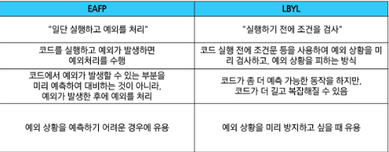

## 에러와 예외

### 1. 버그

> 소프트웨어에서 발생하는 오류 또는 결함, 프로그램의 예상된 동작과 실제 동작 사이의 불일치
> 

#### 실제 버그가 발견된 최초 사례


→ 컴퓨터가 갑자기 제대로 동작하지 않아 원인을 찾아보니 나방이 한 마리 끼어있었음….
그래서 오류라는 뜻을 `bug` 라고 이용한 말장난……

---

### 2. 디버깅

> 소프트웨어에서 발생하는 버그를 찾아내고 수정하는 과정이다. 오작동 원인을 식별하여 수정하는 작업
> 

#### 디버깅 방법

1. `print` 함수 활용
2. 개발환경 (text editor, IDE)등에서 제공하는 기능 활용
3. Python tutor 활용
4. 눈 컴파일, 눈 디버깅


---

### 3. 에러

> 프로그램 실행 중에 발생하는 예외 상황
> 

#### 에러 유형

1. 문법 에러: 오타, 괄호 및 콜론 누락 등 문법적 오류
2. 예외: 프로그램 실행 중에 감지되는 에러

#### 문법 에러 예시

```python
# 문법 오류
while
# SyntaxError: invalid syntax

# 잘못된 할당
5 = 3
# SyntaxError: cannot assing to literal here. Maybe you meant "==" instead of "="?

# Unterminated string literal
print("hello:
# SyntaxError: unterminated string literal (detected at line 1)
```

---

### 4. 예외

> 프로그램 실행 중에 감지되는 에러
> 
1. 프로그램이 잘못된 동작을 시도할 때 자동으로 감지된다.
    - 리스트에 없는 값을 꺼내려 하면 예외 발생!!
2. 상황을 처리하지 않으면 프로그램은 즉시 종료된다.

#### 내장 예외

> 예외 상황을 나타내는 예외 클래스들
> 

#### 내장 예외의 예시

1. `TypeError` : 타입 불일치. 인자 누락, 인자 초과, 인자 타입 불일치 등
2. `NameError` : 지역 또는 전역 이름을 찾을 수 없을 때 발생한다.
3. `ValueError` : 연산이나 함수에 문제가 없지만 부적잘한 값을 가진 인자를 받아 상황이 IndexError처럼 구체적인 예외로 설명되지 않는 경우에 발생한다.
4. `IndexError` : 시퀀스 인덱스가 범위를 벗어날 때 발생한다.
5. `KeyError` : 딕셔너리에 해당 키가 존재하지 않는 경우에 발생한다.
6. `ImportError` : import 하려는 이름을 찾을 수 없을 때 발생한다.
7. `IndentataionError` : 잘못된 들여쓰기와 관련된 문법 오류가 있을 때 발생한다.

---

### 5. 예외 처리

> 예외가 발생했을 때 프로그램이 비정상적으로 종료되지 않고, 적절하게 처리할 수 있도록 하는 방법이다.
> 
1. 예외 처리를 통해 오류가 발생해도 프로그램의 흐름을 안전하게 이어갈 수 있다.
2. 예외 처리를 구현하면 프로그램 사용자에게 오류 메세지를 보여주거나 대체 로직을 실행할 수 있다.

#### 예외처리 사용 구문

1. `try` : 예외가 발생할 수 있는 코드 작성
2. `except` : 예외가 발생했을 때 실행할 코드 작성
3. `else` : 예외가 발생하지 않았을때 실행할 코드 작성
4. `finally` : 예외 발생 여부와 상관없이 항상 실행할 코드 작성

```python
try:
	x = int(input("숫자를 입력하세요."))
	y = 10 / x

except ZeroDivisionError:
	print("0으로 나눌 수 없습니다.")

except ValueError:
	print("유효한 숫자가 아닙니다.")

else:
	print(f"결과: {y}")
	
finally:
	print("프로그램이 종료되었습니다.")
```

#### 예외 처리 주의사항

```python
# 아래와 같이 예외를 작성하면 코드는 2번째 except 절에 이후로 도달하지 못한다.
try:
	num = int(input("100으로 나눌 값을 입력하세요 : "))

# except Exception이 모든 예외를 먼저 가로채기 때문에, 아래에 있는 전용 처리 코드는 실행되지 않는다.
# 범용적인 예외 처리 Exception은 마지막에 두어야 한다.
except Exception:
	print("숫자를 넣어주세요.")

except ZeroDivisionError or:
	print("0으로 나눌 수 없습니다.")
	
except:
	print("에러가 발생하였습니다.")
```

---

### 6. 참고

#### as 키워드

- 예외객체: 예외가 발생했을 때 예외에 대한 정보를 담고 있는 객체이다.
- exception 블록에서 예외 객체를 받아 상세한 예외 정보를 활용할 수 있다.

```python
# error 변수에 담긴 예외 메세지를 출력하면 구체적인 오류 내용을 쉽게 확인이 가능하다.
my_list = []
try:
	number = my_list[1]

except IndexError as error:
	print(f"{error}가 발생했습니다.") # list index out of range가 발생했습니다.
```

#### try-except와 if-else

- try-except와 if-else를 함께 사용할 수 있다.

```python
# 입력한 값이 정수가 아니면 ValueError 예외가 발생해 오류 메세지를 출력한다.
try:
	x = int(input("숫자를 입력하세요 : "))
	
	if x < 0:
		print("음수는 허용되지 않습니다.")
	else:
		print("입력한 숫자", x)

except ValueError:
	print("오류 발생")
```

#### EAFP & LBYL

- EAFP: 예외처리를 중심으로 코드를 작성하는 접근 방식

```python
try:
    num = int(input()) # 입력
    print(100 / num) # 일단 실행

except ZeroDivisionError: # 에러
    print("0으로 나눌 수 없습니다.") # except 처리
```

- LBYL: 값 검사를 중심으로 코드를 작성하는 접근 방식

```python
num = int(input()) # 입력

if num != 0: # 0 인지 확인
    print(100 / num) # 아니면 나누기
else:
    print("0으로 나눌 수 없습니다.")
```



---

### 7. 정리

`버그(Bug)`: 프로그램의 예상된 동작과 실제 동작이 다른 오류나 결함

`디버깅(Debugging)`: 프로그램의 버그를 찾아 원인을 분석하고 수정하는 과정

`문법 에러(Syntax Error)`: 문법이 잘못되어 프로그램을 실행할 수 없는 오류

`예외(Exception)`: 프로그램 실행 중 발생하는 오류

`try`: 예외가 발생할 수 있는 코드를 작성하는 블록

`except`: 예외가 발생했을 때 실행할 코드를 작성하는 블록

`else`: 예외가 발생하지 않았을 때 실행할 코드를 작성하는 블록

`finally`: 예외 발생 여부와 관계없이 항상 실행되는 블록

`EAFP (Easier to Ask for Forgiveness than Permission)`: 일단 실행한 후 예외가 발생하면 처리하는 방식

`LBYL (Look Before You Leap)`: 실행하기 전에 조건을 먼저 검사하는 방식