### 1. Web

1. World Wide Web(Web)
- 인터넷을 통해 웹 문서, 이미지 등의 정보를 하이퍼링크로 연결하여 제공하는 정보 시스템이다.
1. Web site
- 인터넷에서 여러 개의 Web page가 모인 것으로, 사용자들에게 정보나 서비스를 제공하는 공간이다.
1. Web page
- HTML, CSS 등의 웹 기술을 이용하여 만들어진, `Web site` 를 구성하는 하나의 요소이다.

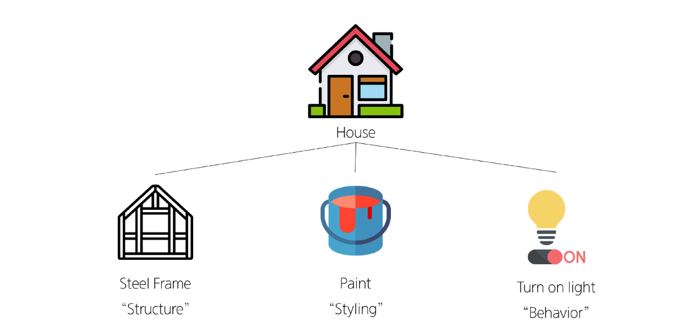
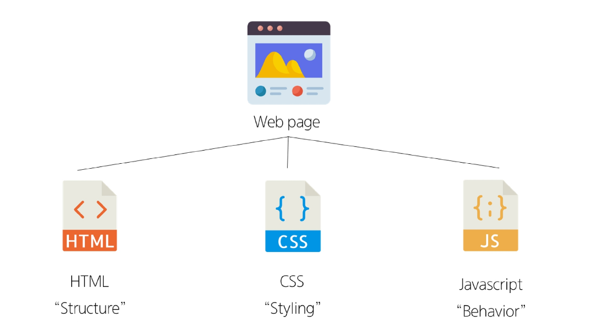

---

### 2. HTML

#### HTML

> 웹 페이지의 의미와 구조를 정의하는 언어이다.
>
- `HyperText` : 다른 문서나 웹 페이지로 이동할 수 있는 하이퍼링크가 포함된 텍스트이다.
- `Markup Language` : 태그 등을 이용하여 문서나 데이터의 구조를 명시하는 언어이다.

#### HTML의 구조

1. `<!DOCTYPE html>` : 해당 문서가 HTML5 문서임을 브라우저에 알려주는 선언문이다.
2. `<html></html>` : 전체 페이지의 콘텐츠를 포함한다.
3. `<head></head>` : HTML 문서에 관련된 설명, 설정 등 컴퓨터가 식별하는 **메타데이터**를 작성한다.
4. `<title></title>` : 브라우저 탭 및 즐겨찾기 시 표시되는 제목으로 사용한다.
5. `<body></body>` : HTML 문서의 내용을 나타내고, 페이지에 표시되는 모든 컨텐츠를 작성한다.

#### html의 전체 구조 예시

```html
<!DOCTYPE html>
<html lang = "en">
<head>
	......
</head>
<body>
	<p> ...
	</p>
</body>
</html>
```

#### HTML Element (요소)

- 일반적인 HTML 요소는 **여는 태그**, **내용**, **닫는 태그**로 구성된다.
- 단, `img`, `meta`, `link`처럼 닫는 태그와 내용이 없는 요소도 있다.

#### HTML Attributes (속성)

- 사용자가 원하는 기준에 맞도록 요소를 설정하거나 다양한 방식으로 요소의 동작을 조절하기 위한 값을 표현한다.


> 💡**작성 규칙**
> 
> - 속성은 요소 이름과 속성 사이에 공백이 있어야한다.
> 
> - 하나 이상의 속성들이 있는 경우엔 속성 사이에 공백으로 구분한다.
> 
> - 속성 값은 열고 닫는 따옴표로 감싸야 한다.


```html
<p                 class="editor-note"> My cat is very grumpy </p>
└ 시작 태그          └ 속성                 └ 내용              └ 종료 태그
```

#### 출력해보기

```html
<!DOCTYPE html>
<html lang="en">
<head>
    <meta charset="UTF-8">
		<meta name="viewport" content="width=device-width, initial-scale=1.0">
    <title>Documents</title>
</head>
    <body>
        <!--h1 태그-->
        <h1>해드1</h1>
        <!--h2 태그-->
        <h2>해드2</h2>
        태그없이 사용하면
        이렇게 된다
        <!--p 태그-->
        <p>html 연습</p>
        <p>헬로우ㅋㅋ</p>
        <!--a 링크 연결 태그-->
        <a href="https://github.com/king-dong-gun">GitHub 링크를 a 태그로 준다.</a>
        <!--로컬 이미지를 출력-->
        <p>로컬 이미지를 프로젝트 내 상대 경로로 출력한다. img src="./images/sample.png"</p>
        <p>이미지가 출력되지 않을 때 대체 텍스트를 출력하려면 img src="./images/sample.png" alt = 대체 문구</p>
        
        <!--웹에 있는 이미지를 출력-->
        
        <!--ol과 li로 리스트 출력-->
        <ol>
        <li>리스트1</li>
        <li>리스트2</li>
        <li>리스트3</li>
        </ol>
    </body>
</html>

```

#### 화면 결과

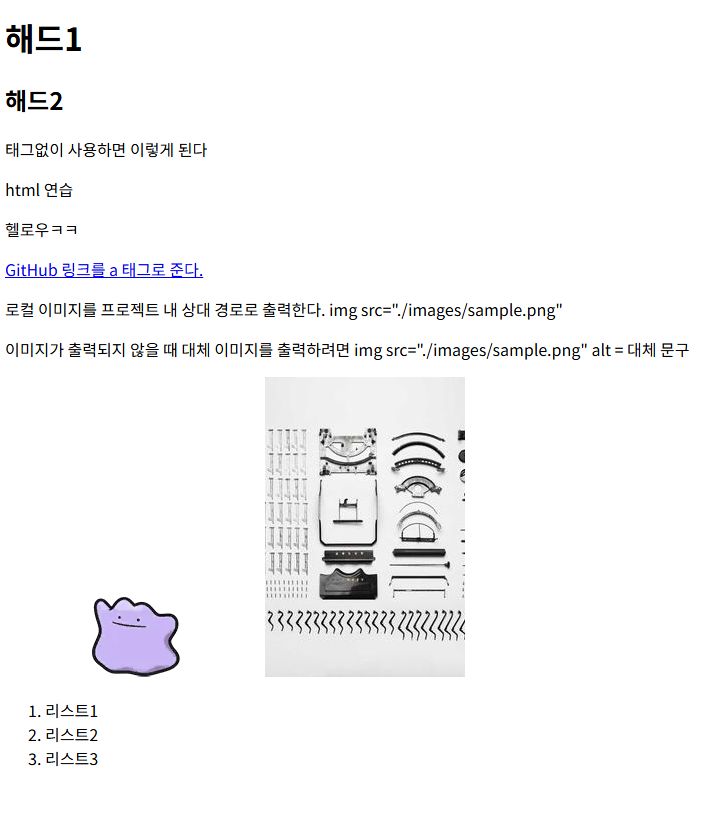

---

### 3. CSS

> 웹 페이지의 디자인과 레이아웃을 구성하는 언어이다.
>

#### CSS 구문

- `선택자` : 누구를 꾸밀지 지정하는 부분이다.
    - 전체(*) 선택자 : 모든 요소를 선택한다.
    - 요소(tag) 선택자: 지정한 모든 태그를 선택한다.
    - 클래스(”.”) 선택자: 주어진 클래스 속성을 가진 모든 요소를 선택한다.
    - 아이디(`#`) 선택자: 주어진 `id` 속성값을 가진 요소를 선택한다.
        - 동일한 `id` 값은 한 문서에서 한 번만 사용해야 한다.
    - 속성([]) 선택자: 주어진 속성이나 속성값을 가진 모든 요소를 선택한다.
    - 자손 결합자 (`공백`) : 특정 요소 내부의 모든 하위 요소를 선택한다.
    - 자식 결합자 (`>`) : 특정 요소의 바로 아래에 있는 자식 요소만 선택한다.

    ```css
    /* point-text 안쪽의 모든 li 선택 */ 
    .point-text li { 
    	color: brown; 
    } 
    
    /* point-text 바로 아래의 span만 선택 */ 
    .point-text > span { 
    	font-size: 50px; 
    }
    ```

- `선언` : `선언`은 선택한 요소에 적용할 `속성: 값`의 한 쌍이며 일반적으로 세미콜론으로 구분한다.
- `속성` : 바꾸고 싶은 스타일의 종류를 나타낸다.
- `값` : 속성에 적용할 구체적인 설정을 나타낸다.

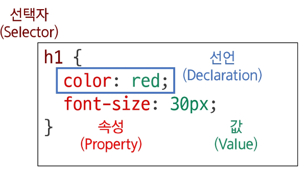

```html
<!DOCTYPE html>
<html lang="en">

<head>
  <meta charset="UTF-8">
  <meta name="viewport" content="width=device-width, initial-scale=1.0">
  <title>Document</title>
  <style>
    /* 전체 선택자 */
    * {
      color: red;
    }

    /* 요소 선택자 */
    h2 {
      color: orange;
    }

    h3,
    h4 {
      color: blue;
    }

    /* 클래스 선택자 */
    .point-text {
      color: green;
    }

    /* id 선택자 */
    #course-title {
      color: purple;
    }

    /* 속성 선택자 */
    [class^="sub"] {
      color: yellow;
    }

    /* 자식 결합자 */
    .point-text>span {
      font-size: 50px;
    }

    /* 자손 결합자 */
    .point-text li {
      color: brown;
    }
  </style>
</head>

<body>
  <h1 class="point-text">Heading</h1>
  <h2>선택자 연습</h2>
  <h3>Hello</h3>
  <h4>Nice to meet you</h4>
  <p id="course-title">과목 목록</p>
  <ul class="point-text">
    <li>파이썬</li>
    <li>알고리즘</li>
    <li>웹
      <ol>
        <li>HTML</li>
        <li>CSS</li>
        <li>PYTHON</li>
      </ol>
    </li>
  </ul>
  <p class="point-text">
    Lorem, <span>ipsum</span> dolor.
  </p>
  <p class="sub-note">TEST</p>
</body>

</html>

```

#### 화면 결과

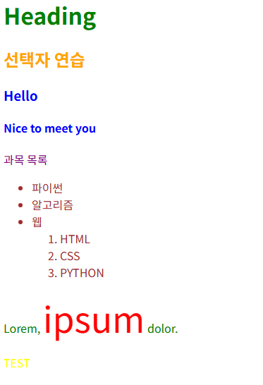

#### CSS 적용 방법

1. 인라인 스타일
    - HTML 요소 안에 style 속성 값으로 작성한다.

    ```html
    <!DOCTYPE html>
    ...
    <body>
    	<h1 style="color: blue; background-color: red;">
    	  인라인 스타일
    	</h1>
    </body>
    
    </html>
    
    ```

2. 내부 스타일
    - head 태그 안에 style 태그에 작성한다

    ```html
    <!DOCTYPE html>
    ...
    <head>
    	<title> 내부 스타일 </title>
      <style >
    	  h2 { 
    			  color : red;
    			  }
      </style >
    </head>
    
    ```

3. 외부 스타일
    - 별도 CSS 파일 생성 후 HTML link 태그를 사용해서 불러온다.

    ```html
    <!DOCTYPE html>
    ...
    <head>
    	...
    	<link rel="stylesheet" href="style.css">
    	<title> 외부 스타일 </title>
    </head>
    
    ```

    ```css
    /* style.css */
    h3 {
    	color: red;
    }
    ```


#### 명시도

- 요소에 적용할 CSS 선언을 결정하기 위한 알고리즘이다.
- 명시도는 선택자들의 우선순위 싸움이다.
- 가중치를 계산해 어떤 스타일을 적용할지 결정한다.

#### CSS 스타일 우선 적용 순서

1. `!important`가 적용된 선언

2. `인라인 스타일`

3. `id 선택자 > class·속성 선택자 > 요소 선택자`

4. 앞의 우선순위가 같다면 CSS에서 나중에 선언된 스타일

#### 명시도 예

```html
<!DOCTYPE html>
<html lang="en">

<head>
  <meta charset="UTF-8">
  <meta name="viewport" content="width=device-width, initial-scale=1.0">
  <title>Document</title>
  <style>
    h2 {
      color: darkviolet !important;
    }

    p {
      color: blue;
    }

    .orange {
      color: orange;
    }

    .green {
      color: green;
    }

    #red {
      color: red;
    }
  </style>
</head>

<body>
  <p>p 태그라서 파란색</p>
  <p class="orange">p보다 클래스가 더 세서 주황색</p>
  <p class="green orange">얘넨 왜 같은 색일까?</p>
  <p class="orange green">.orange와 .green은 둘 다 클래스 선택자라서 동급이지만 CSS에서 나중에 작성된 .green이 이김.</p>
  <p id="red" class="orange">class가 덤벼도 id가 더 세서 빨간색</p>
  <h2 id="red" class="orange">id와 class가 덤벼도 !important가 이겨서 보라색</h2>
  <p id="red" class="orange" style="color: brown;">인라인 스타일이 직접 등장해서 갈색</p>
  <h2 id="red" class="orange" style="color: brown;">인라인 스타일도 h2의 !important 앞에서는 보라색</h2>
</body>
</html>

```

<aside>
💡

해당 코드는 CSS 명시도 비교를 위한 실습 예제이다. 실제 HTML에서는 같은 `id` 값을 여러 요소에 중복해서 사용하면 안 된다.

</aside>

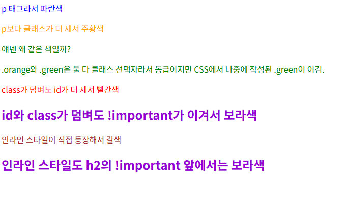

### 4. CSS 선언

> 선택된 요소에 적용할 스타일을 구체적으로 명시하는 부분이다.
>

```css
h1 {
  color: red;       /* color: 속성, red: 값, 전체가 선언 */
  font-size: 30px;  /* font-size: 속성, 30px: 값, 전체가 선언 */
}
```

#### 값의 단위

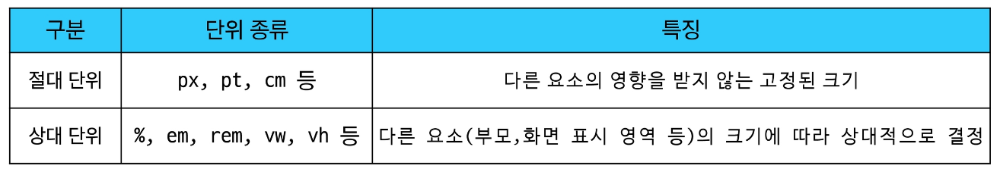

#### CSS 박스 모델

> 웹 페이지의 모든 HTML 요소를 사각형 상자로 표현하는 모델이다.
내용(content), 안쪽 여백(padding), 테두리(border), 바깥 여백(margin)으로 구성된다.
>

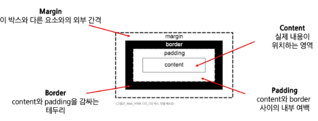

#### 네이버의 박스모델

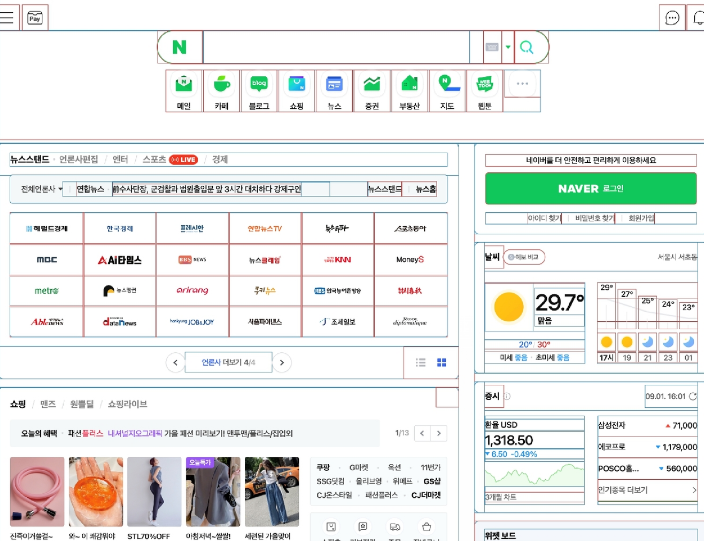

#### 박스 구성 요소 예시

```html
<!DOCTYPE html>
<html lang="ko">

<head>
  <meta charset="UTF-8">
  <meta name="viewport" content="width=device-width, initial-scale=1.0">
  <title>Box 구성 요소 예시</title>

  <style>
    /* box1: 여백도 골라서 받는 까다로운 박스 */
    .box1 {
      width: 200px;

      /* 안쪽 여백: 왼쪽과 아래쪽만 챙김 */
      padding-left: 25px;
      padding-bottom: 25px;

      /* 바깥 여백: 왼쪽으로 25px, 위로 50px 거리 두기 */
      margin-left: 25px;
      margin-top: 50px;

      /* 테두리는 3px짜리 검은 실선으로 */
      border-width: 3px;
      border-style: solid;
      border-color: black;
    }

    /* box2: 가운데 자리 박스 */
    .box2 {
      width: 200px;

      /* 위아래 25px, 좌우 50px 안쪽 여백 */
      padding: 25px 50px;

      /* 위아래 25px, 좌우는 자동으로 계산해서 가운데 정렬 */
      margin: 25px auto;

      /* 살짝 애매한 검은 점선 테두리 */
      border: 1px dashed black;
    }
  </style>
</head>

<body>
  <div class="box1"> 한쪽 여백만 챙기는 box1</div>

  <div class="box2"> 가운데 box2</div>
</body>

</html>
```

#### body의 콘텐츠 영역

개발자 도구에서 `body`를 선택했을 때 파란색으로 표시된 부분이 `body`의 콘텐츠 영역이다.

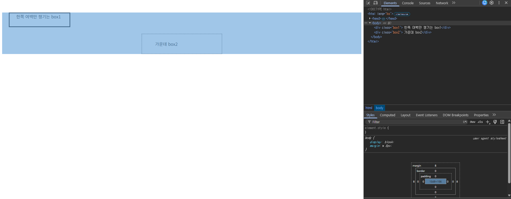

#### body의 기본 마진 영역

주황색으로 표시된 가장자리 부분은 브라우저가 `body`에 기본으로 적용한 `8px`의 마진이다.

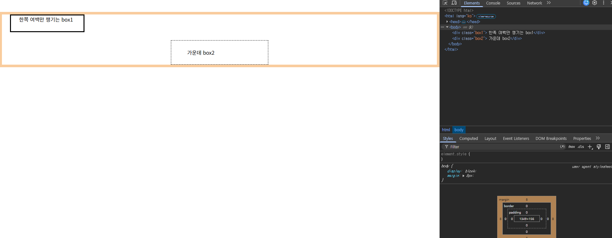

#### 박스의 실제 크기

기본값인 `box-sizing: content-box`에서는 `width`와 `height`가 콘텐츠 영역의 크기만 의미한다.

>💡 실제 너비는 다음과 같이 계산된다.
> 
> `실제 너비 = width + 좌우 padding + 좌우 border`
> 
> `border-box`를 사용하면 지정한 `width` 안에 padding과 border가 포함되어 크기를 계산하기 편하다.

